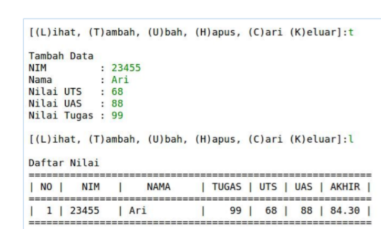
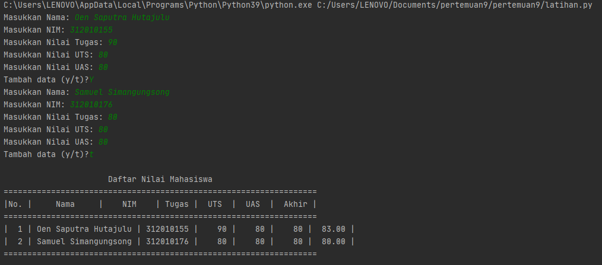

# pertemuan9modul5 <br>

Pada Pertemuan 9 Modul 5 dosen memberikan saya tugas untuk membuat program sederhana yang akan menampilkan daftar nilai mahasiswa. berikut soal yang dosen berikan: <br>



Penjelasan: Penggunaan if c.lower() if c.lower() fungsinya apabila user menginputkan dengan huruf besar, maka otomatis akan menjadi huruf kecil sehingga kondisi yang diinginkan tercapai. contoh: <br>
```
if c.lower() == 'q'
```

Penggunaan while True while True berfungsi untuk mendeteksi jika format yang diinputkan bukan berupa type maka akan muncul eror *Penggunaan else Fungsi else ialah jika tidak eror dan type yang dimasukan sesuai maka proses while True Pengunaan valueError Fungsinya apabila diinputkan bukan berupa type maka hasilnya error (valueError) berikut source codenya: <br>

```
   while (True):
                        nama = input(" Nama : ")
                        if nama == '':
                            P(' Masukan dengan Nama Dengan Benar')
                        else:
                            break
                    while (True):
                        try:
                            nim  = int(input(" NIM  : "))
                            if nim == '':
                                P(' Masukan Nim dengan Angka')
                        except ValueError:
                            P(' Masukan Nim dengan Angka')
                        else:
                            break
                    while (True):
                        try:
                            tugas  = int(input(" TUGAS  : "))
                            if tugas == '':
                                P(' Masukan TUGAS dengan Angka')
                        except ValueError:
                            P(' Masukan TUGAS dengan Angka')
                        else:
                            break
```

Pengunaan round dan float round digunakan untuk menentukan banyaknya angka di belakang koma, sedangkan float digunakan untuk mengubah bilangan menjadi float(desimal) Berukut Source codenya: akhir = round((float(tugas) * 0.3)+(float(uts) * 0.35)+(float(uas) * 0.35),2) i.write('\nNama : '+nama+'|Nim : '+str(nim)+'|Tugas : '+str(tugas)+'|UTS : '+str(uts)+'|UAS : '+str(uas)+"|Akhir : "+str(akhir)+'\n') i.close() Berikut Source code lengkapnya... #Membuat Program Sederhana Menampilkan Daftar Nilai Mahasiswa <br>

P = print while True: P("") P("") c = input("L)ihat, T)ambah, U)bah, H)apus, C)ari, K)eluar: ") if c.lower() == 'q': break elif c.lower() == 'l': i = open('database.txt','r').read().splitlines() P(" <br>

╔═════════════════════════════════════════════════════════════════════╗") P(" ╠════════════════════════════ DAFTAR KONTAK ══════════════════════════╣") P(" ╠══════════════════╦══════════════════╦═══════╦═══════╦═══════╦═══════╣") P(" ║ NAMA ║ NIM ║ TUGAS ║ UTS ║ UAS ║ AKHIR ║") P(" ╠══════════════════╬══════════════════╬═══════╬═══════╬═══════╬═══════╣") for l in i: if l == '': pass else: l1 = l.replace('Nama : ','').replace('Nim : ','').replace('Tugas : ','').replace('UTS : ','').replace('UAS : ','').replace('Akhir : ','') na,ni,tu,uts,uas,akhir = l1.strip().split('|') P((' ║ ')+(na[:15]).ljust(17,'.')+('║ ')+(ni).ljust(17)+('║ ')+(tu).ljust(6)+('║ ')+(uts).ljust(6)+('║ ')+(uas).ljust(6)+('║ ')+(akhir).ljust(6)+('║')) P(" ╚══════════════════╩══════════════════╩═══════╩═══════╩═══════╩═══════╝") elif c.lower() == 'c': cari = input(' Mencari : ') i = open('database.txt','r').read().splitlines() P(" ╔═════════════════════════════════════════════════════════════════════╗") P(" ╠════════════════════════════ DAFTAR KONTAK ══════════════════════════╣") P(" ╠══════════════════╦══════════════════╦═══════╦═══════╦═══════╦═══════╣") P(" ║ NAMA ║ NIM ║ TUGAS ║ UTS ║ UAS ║ AKHIR ║") P(" ╠══════════════════╬══════════════════╬═══════╬═══════╬═══════╬═══════╣") for l in i: if l == '': pass elif cari in l: l1 = l.replace('Nama : ','').replace('Nim : ','').replace('Tugas : ','').replace('UTS : ','').replace('UAS : ','').replace('Akhir : ','') na,ni,tu,uts,uas,akhir = l1.strip().split('|') P((' ║ ')+(na).ljust(17)+('║ ')+(ni).ljust(17)+('║ ')+(tu).ljust(6)+('║ ')+(uts).ljust(6)+('║ ')+(uas).ljust(6)+('║ ')+(akhir).ljust(6)+('║')) P(" ╚══════════════════╩══════════════════╩═══════╩═══════╩═══════╩═══════╝") <br>

elif c.lower() == 'h': u = open('database.txt','r').read().splitlines() target = input(' Masukan Nama : ') nm = [] for l in u: if l == '': pass else: l1 = l.replace('Nama : ','').replace('Nim : ','').replace('Tugas : ','').replace('UTS : ','').replace('UAS : ','').replace('Akhir : ','') na,ni,tu,uts,uas,akhir = l1.strip().split('|') if str(na) == str(target): P('BERHASIL MENGHAPUS Data %s'%(target)) pass else: <br>

```
       else:
                nm.append(str(l)+'\n')
    new = open('database.txt','w')
    new.write(str(nm))
    new.close()
    new = open('database.txt','r').read().splitlines()
    new1 = open('database.txt','w')
    new1.close()
    new2 = open('database.txt','a')
    for i in new:
        i2 = i.replace("['","").replace("\\n', '", "\n").replace("']","").replace("\\n",'')
        new2.write(i2)
    new2.close()
elif c.lower() == 'u':
    u = open('database.txt','r').read().splitlines()
    target = input(' Masukan Nama : ')
    nm = []
    for l in u:
        if l == '':
            pass
        else:
            l1 = l.replace('Nama : ','').replace('Nim : ','').replace('Tugas : ','').replace('UTS : ','').replace('UAS : ','').replace('Akhir : ','')
            na,ni,tu,uts,uas,akhir = l1.strip().split('|')
            if na == target:
                P(' Mengedit Data %s'%(target))
                while (True):
                    nama = input(" Nama : ")
                    if nama == '':
                        P(' Masukan dengan Nama Dengan Benar')
                    else:
                        break
                while (True):
                    try:
                        nim  = int(input(" NIM  : "))
                        if nim == '':
                            P(' Masukan Nim dengan Angka')
                    except ValueError:
                        P(' Masukan Nim dengan Angka')
                    else:
                        break
                while (True):
                    try:
                        tugas  = int(input(" TUGAS  : "))
                        if tugas == '':
                            P(' Masukan TUGAS dengan Angka')
                    except ValueError:
                        P(' Masukan TUGAS dengan Angka')
                    else:
                        break
                while (True):
                    try:
                        uts  = int(input(" UTS  : "))
                        if uts == '':
                            P(' Masukan UTS dengan Angka')
                    except ValueError:
                        P(' Masukan UTS dengan Angka')
                    else:
                        break
                while (True):
                    try:
                        uas  = int(input(" UAS  : "))
                        if uas == '':
                            P(' Masukan UAS dengan Angka')
                    except ValueError:
                        P(' Masukan UAS dengan Angka')
                    else:
                        break
                akhir = round((float(tugas) * 0.3)+(float(uts) * 0.35)+(float(uas) * 0.35),2)
                edit  =('Nama : '+nama+'|Nim : '+str(nim)+'|Tugas : '+str(tugas)+'|UTS : '+str(uts)+'|UAS : '+str(uas)+"|Akhir : "+str(akhir)+'\n')
                nm.append(edit+'\n')
            else:
                nm.append(str(l)+'\n')
    new = open('database.txt','w')
    new.write(str(nm))
    new.close()
    new = open('database.txt','r').read().splitlines()
    new1 = open('database.txt','w')
    new1.close()
    new2 = open('database.txt','a')
    for i in new:
        i2 = i.replace("['","").replace("\\n', '", "\n").replace("']","").replace("\\n","\n")
        new2.write(i2+'\n')
    new2.close()
elif c.lower() == 't':
    i = open('database.txt','a')
    P(" Tambah Kontak")
    while (True):
        nama = input(" Nama : ")
        if nama == '':
            P(' Masukan dengan Nama Dengan Benar')
        else:
            break
    while (True):
        try:
            nim  = int(input(" NIM  : "))
            if nim == '':
                P(' Masukan Nim dengan Angka')
        except ValueError:
            P(' Masukan Nim dengan Angka')
        else:
            break
    while (True):
        try:
            tugas  = int(input(" TUGAS  : "))
            if tugas == '':
                P(' Masukan TUGAS dengan Angka')
        except ValueError:
            P(' Masukan TUGAS dengan Angka')
        else:
            break
    while (True):
        try:
            uts  = int(input(" UTS  : "))
            if uts == '':
                P(' Masukan UTS dengan Angka')
        except ValueError:
            P(' Masukan UTS dengan Angka')
        else:
            break
    while (True):
        try:
            uas  = int(input(" UAS  : "))
            if uas == '':
                P(' Masukan UAS dengan Angka')
        except ValueError:
            P(' Masukan UAS dengan Angka')
        else:
            break
    akhir = round((float(tugas) * 0.3)+(float(uts) * 0.35)+(float(uas) * 0.35),2)
    i.write('\nNama : '+nama+'|Nim : '+str(nim)+'|Tugas : '+str(tugas)+'|UTS : '+str(uts)+'|UAS : '+str(uas)+"|Akhir : "+str(akhir)+'\n')
    i.close()
else:
    P("Silahkan pilih menu yang tersedia...")
```
